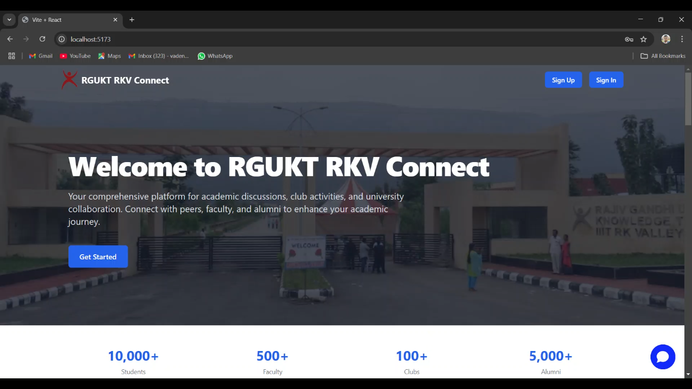
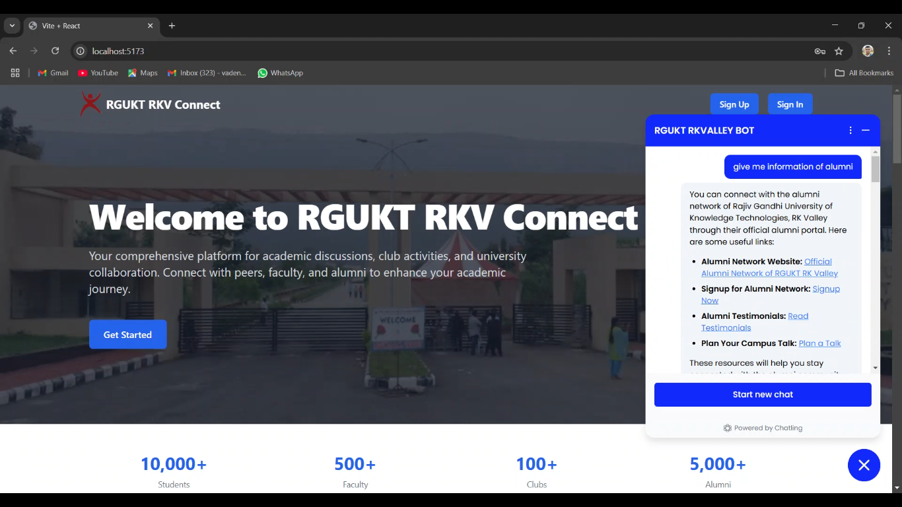
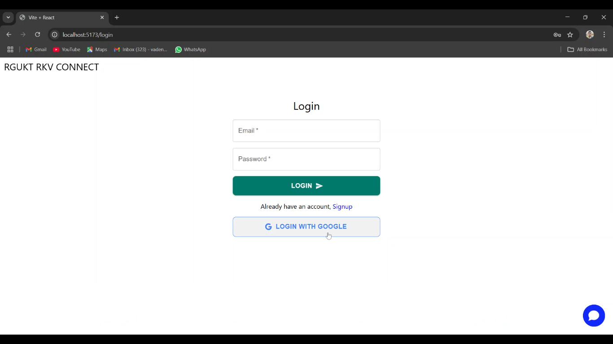
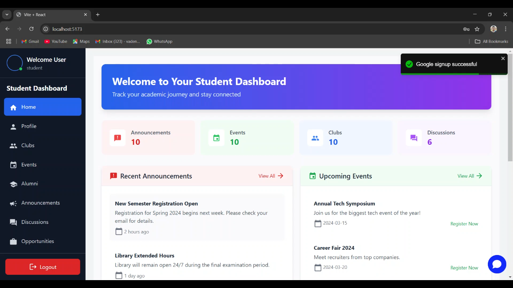
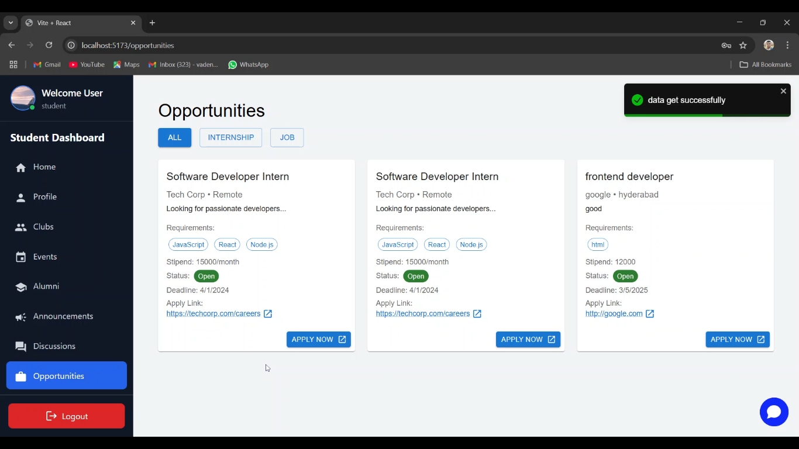
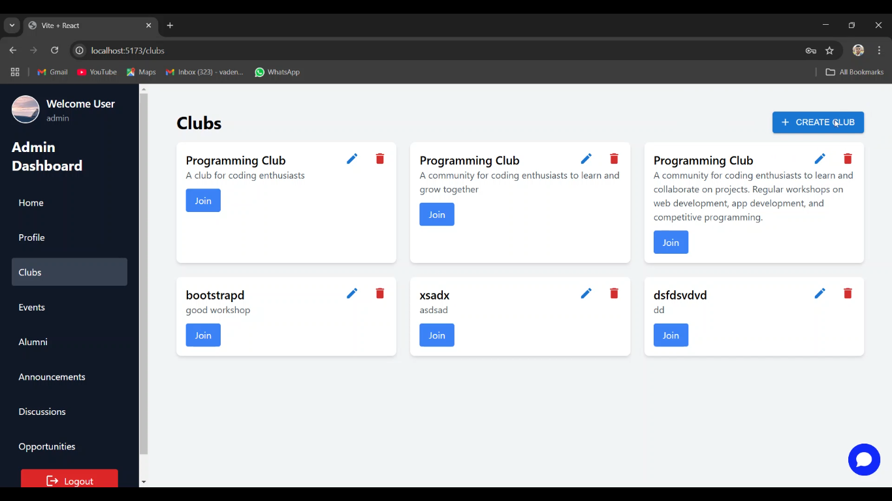
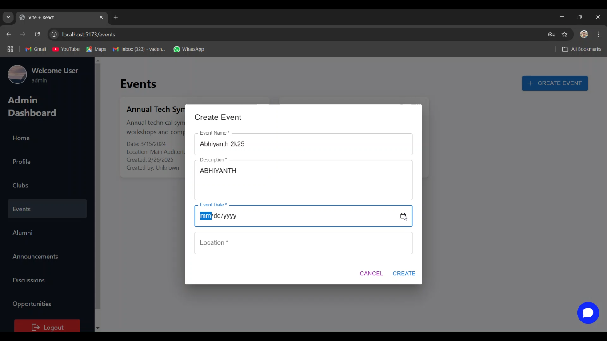
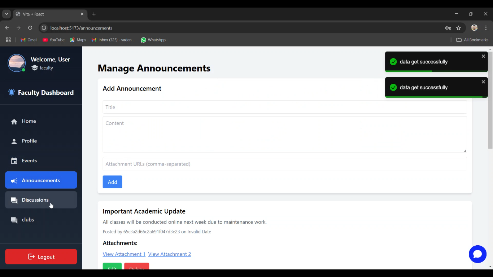
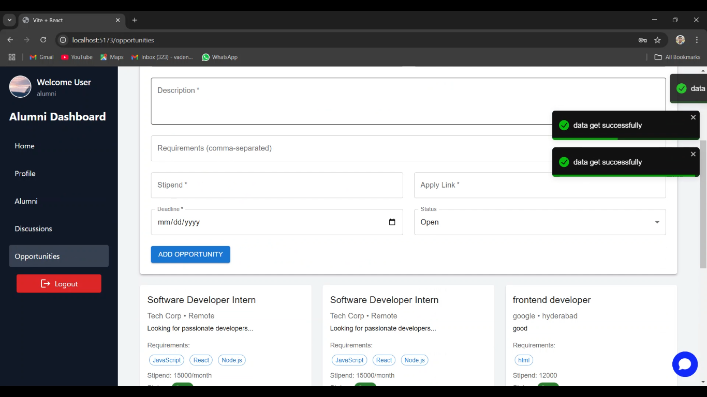

# 🚀 University Discussion & Collaboration Platform  

## 📌 Problem Overview  

  
Click to expand the problem statement

### Universities often struggle with communication and collaboration among students, faculty, and alumni. Existing methods such as WhatsApp groups, notice boards, and scattered emails lead to unstructured discussions, missed updates, and inefficient coordination.  

This hackathon challenge is to **build a unified digital platform** that enhances academic engagement, streamlines university communication, connects students with alumni, and enables real-time interactions among students, faculty, and clubs.  

---

## 🎯 Challenge  
Develop an innovative **University Discussion & Collaboration Platform** where users can:  
✅ **Engage in structured academic discussions** with peers and faculty.  
✅ **Access university schedules** like class timetables and exam calendars.  
✅ **Receive real-time notifications** for announcements and events.  
✅ **Join, manage, and interact with student clubs** through an admin-driven system.  
✅ **Collaborate efficiently** using discussion forums, polls, Q&A, and live sessions.  
✅ **Stay updated with official notices** from faculty and administration.  
✅ **Use a chatbot to quickly get answers** related to university schedules, events, and academic queries.  
✅ **Explore career and internship opportunities** through job postings and networking.  
✅ **Connect with alumni** for mentorship, networking, and career guidance.  

Your solution should be **scalable, user-friendly, and accessible across multiple devices**.  

---

## 💡 Key Features  

### 🔹 University Discussion Forum  
- Structured discussion threads based on topics (Academics, Events, Clubs, Placements, etc.).  
- Reputation system to encourage meaningful contributions.  
- Search functionality for easy access to past discussions.  

### 🔹 University Announcements & Notifications  
- Faculty/admins can post official announcements (exam schedules, events, results).  
- Students receive real-time notifications for important updates.  
- Personalized feeds based on courses and interests.  

### 🔹 Student Timetables & Scheduling  
- Dynamic, personalized class schedules.  
- Exam date tracking with reminders.  
- Event calendar with RSVP & scheduling options.  

### 🔹 Club Management & Admin Panel  
- **Admin Panel:** University admins can create/manage clubs, assign coordinators, and monitor activities.  
- **Club Coordinators:** Club heads can post updates, schedule events, and manage members.  
- **Membership System:** Students can browse and join clubs with approval mechanisms.  
- **Event Planning:** Clubs can organize events, track participation, and share updates.  

### 🔹 Real-Time Interactions & Chatbot  
- Live Q&A sessions with professors and peers.  
- Integrated chatrooms for study groups, clubs, and faculty discussions.  
- A chatbot to assist students with university-related queries (class timings, event schedules, academic help).  

### 🔹 Career & Extracurricular Opportunities  
- **Internship & Job Posting Board** where companies/university can post job openings.  
- **Hackathon & Project Collaboration Hub** to connect students for competitions and research projects.  
- **Club & Society Discussion Spaces** to help students find extracurricular activities that match their interests.  

### 🔹 Alumni Network & Professional Growth  
- **Alumni Directory** with profiles, career details, and achievements.  
- **Networking Portal** for students to connect with alumni for career advice and mentorship.  
- **Guest Talks & Webinars** by alumni to share experiences and industry insights.  
- **Job Referrals & Industry Connections** facilitated through alumni engagement.  

### 🔹 Moderation & Security  
- Content moderation to prevent spam and maintain a respectful environment.  
- Role-based access control (Students, Faculty, Admins, Club Coordinators, Alumni).  
- Secure authentication (SSO, University Email Verification, OTP).  

---

## 🛠️ Implementation Flexibility  
You are free to implement the solution in any way you prefer:  
✔ **Web-based platform**  
✔ **Mobile app**  
✔ **Desktop application**  
✔ **Chatbot** (for instant responses and FAQs)  
✔ **Cloud-based system**  
✔ **Any other approach** that effectively solves the problem  

The **technology stack is entirely up to you**. You can integrate databases, automation, real-time messaging, or any other solutions that improve usability and efficiency.  

---

## 🔍 Judging Criteria  
Projects will be evaluated based on:  
- **Explanation** – Clarity in presenting and justifying the project.  
- **UI/UX** – Intuitive and accessible interface design.  
- **Functionality** – How well the platform meets university needs.  
- **Innovation & Creativity** – Unique and effective solutions.  
- **Technical Implementation** – Code quality, architecture, and security.  
- **Performance & Scalability** – Ability to handle real-world usage efficiently.  

---

## 📅 Submission Guidelines  
- **Faculty and organizers will review projects in person** and evaluate different aspects.  
- **Mid-term evaluation** will be conducted in the afternoon.  
- **Final evaluation** will be conducted at night.  
- **After the hackathon**, participants must **post a video demonstration** of their project and **tag Abhiyanth and the Department of Computer Science and Engineering** on social media.  

---

## 🎖️ Bonus Challenges (For Extra Points!)  
🔹 **Advanced chatbot features** (e.g., answering academic queries, event updates).  
🔹 **Gamification** (badges, leaderboards, and rewards for participation).  
🔹 **Offline functionality** for accessing important university info.  
🔹 **Multi-language support** for diverse student accessibility.  
🔹 **Smart career suggestions** based on student interests and alumni data.  

---

This problem statement ensures **maximum flexibility** and **comprehensive features**, allowing teams to explore different approaches while keeping it **university-focused**. 🚀  

Good luck, and happy hacking! 🎯  

---

## 📸 Website Screenshots  
Here are some visuals showcasing our platform:  

### 🏠 **Home Page**  
   

### 🤖 **Chatbot**  
     

### 🔐 **Login Page**  
     

### 🎓 **Student Dashboard**  
   
     

### 🛠️ **Admin Dashboard**  
   
    

### 🏫 **Faculty Section**  
     

### 🌍 **Alumni Network**  
     

These images illustrate the core functionalities of our platform, providing an intuitive and seamless experience for students, faculty, and alumni alike. 🚀

